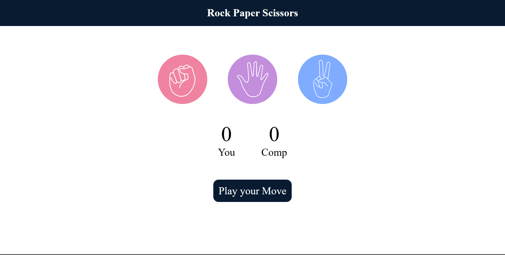

# ✊✋✌️ Rock Paper Scissors - Web Game

A simple and interactive Rock Paper Scissors game built using HTML, CSS, and JavaScript. Users can choose between rock, paper, or scissors and play against a computer opponent with real-time score updates and visual feedback.

---

## 🎮 Features

- Click-based gameplay
- Responsive user interface with icons
- Score tracking for both player and computer
- Randomized computer moves
- Clean and simple design

---

## 📸 Screenshot



---

## 🧩 Technologies Used

- **HTML** – Structure
- **CSS** – Styling and animations
- **JavaScript** – Game logic and DOM manipulation

---

## 🚀 How to Run Locally

1. Clone the repository:
   ```bash
   git clone https://github.com/your-username/rock-paper-scissors-game.git
   cd rock-paper-scissors-game
